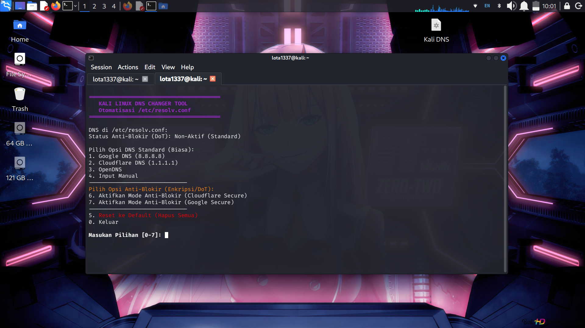
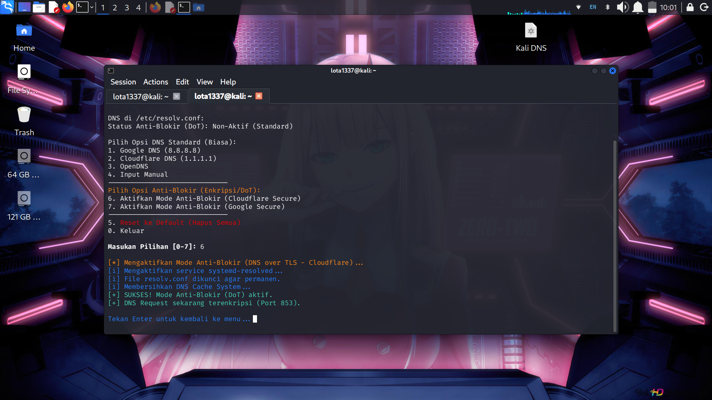
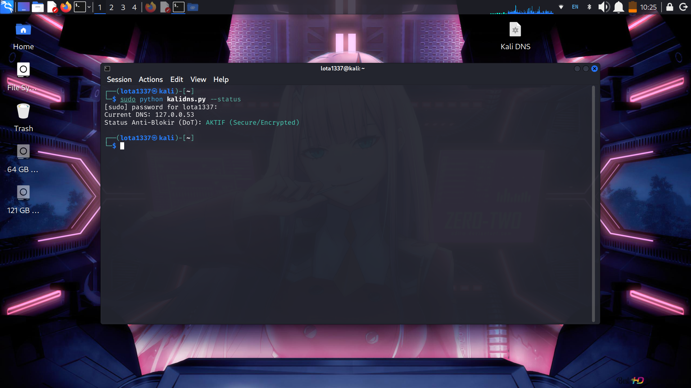

# KaliDNS Switcher (Ultimate Edition) 🛡️

KaliDNS Switcher is a production-grade CLI tool designed for Penetration Testers and Linux Power Users. It allows you to switch DNS providers instantly, benchmark connection speeds, and enable DNS-over-TLS (DoT) to bypass censorship and prevent DNS poisoning/hijacking.

**Note:** This tool uses atomic file writing and `chattr` locking to ensure your DNS configuration persists even after a reboot or NetworkManager restart.

## 🔥 Key Features

*   **🛡️ Secure Anti-Censorship (DoT):** Enable DNS-over-TLS (Cloudflare/Google) to bypass ISP blocking transparently using `systemd-resolved`.
*   **⚡ Speed Benchmark:** Automatically test and find the fastest DNS provider for your connection.
*   **🔒 Atomic Writes & Locking:** Prevents configuration corruption and locks `/etc/resolv.conf` to prevent overwrites by the OS.
*   **🕵️ DNS Leak Test:** Built-in connectivity check to ensure your DNS requests are resolving correctly.
*   **💾 Auto-Backup & Cleanup:** Automatically backs up configuration files before changes and cleans old backups to save disk space.
*   **📝 Logging System:** Detailed activity logs stored in `/var/log/kalidns/`.

## 📸 Screenshots

<div align="center">
  
  
  *Main menu interface showing available DNS options*
  
  
  *DNS speed benchmark test results*
  
  
  *Current system status and DNS configuration*

</div>
dd

## 🚀 Installation & Usage

You can run this script directly without installation.

1.  Clone the repository:
    ```bash
    git clone https://github.com/YOUR_USERNAME/KaliDNS-Switcher.git
    cd KaliDNS-Switcher
    ```

2.  Make it executable:
    ```bash
    chmod +x kalidns.py
    ```

3.  Run the tool (Root required):
    ```bash
    sudo ./kalidns.py
    ```
    Or use Python directly:
    ```bash
    sudo python3 kalidns.py
    ```

## 🎮 CLI Arguments (Non-Interactive Mode)

You can use arguments for quick switching:

| Command                     | Description                                |
| :-------------------------- | :----------------------------------------- |
| `sudo ./kalidns.py 1`       | Switch to Google DNS instantly             |
| `sudo ./kalidns.py 2`       | Switch to Cloudflare DNS instantly         |
| `sudo ./kalidns.py --test`  | Run DNS Leak/Connection Test               |
| `sudo ./kalidns.py --benchmark` | Run Speed Test on all presets          |
| `sudo ./kalidns.py --status`| Show current DNS & DoT status              |
| `sudo ./kalidns.py --reset` | Restore to Default (DHCP)                  |

## 🛠️ Presets Included

*   **Google (`8.8.8.8`)** - Standard & Fast
*   **Cloudflare (`1.1.1.1`)** - Privacy & Speed
*   **Quad9 (`9.9.9.9`)** - Malware Blocking
*   **AdGuard** - Ad Blocking
*   **CleanBrowsing** - Family Filter

## 🤝 Contributing

Contributions are welcome! Please feel free to submit a Pull Request.

1.  Fork the Project
2.  Create your Feature Branch (`git checkout -b feature/AmazingFeature`)
3.  Commit your Changes (`git commit -m 'Add some AmazingFeature'`)
4.  Push to the Branch (`git push origin feature/AmazingFeature`)
5.  Open a Pull Request

## 📜 License

Distributed under the MIT License. See `LICENSE` for more information.
