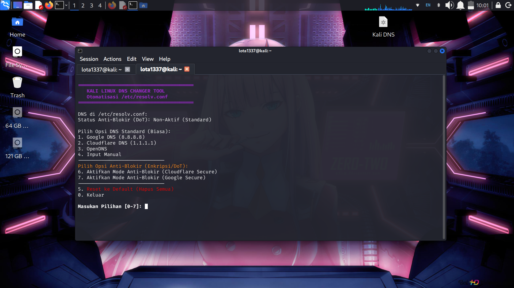
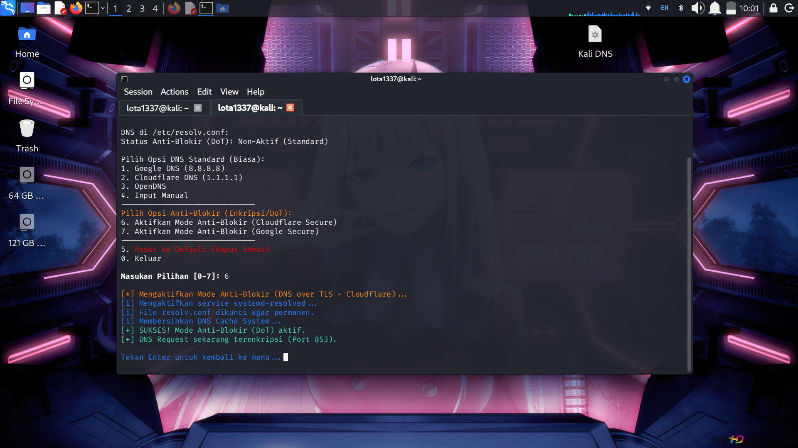
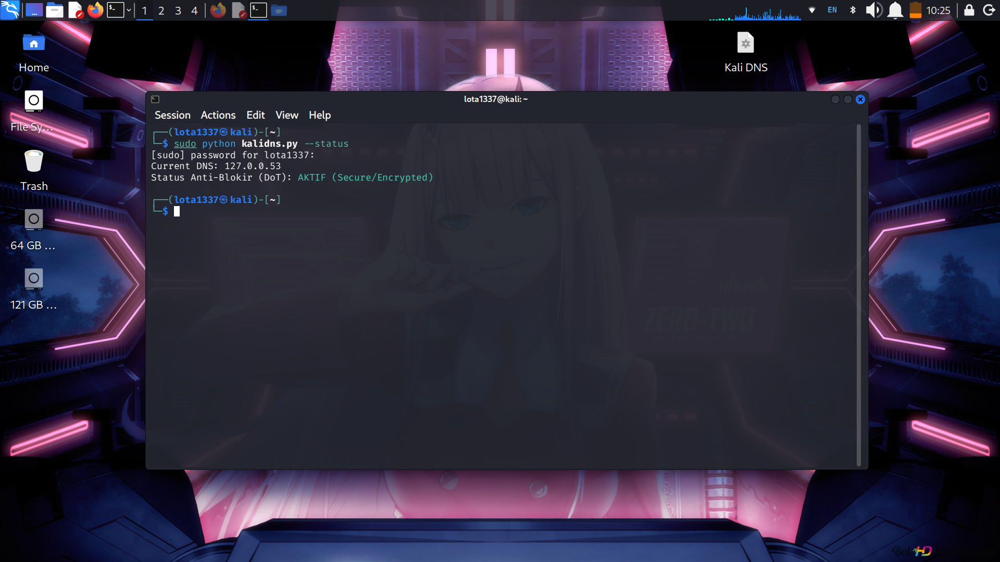

# KaliDNS Switcher (Modular Edition v2.1) 🛡️

KaliDNS Switcher is a production-grade CLI tool designed for Penetration Testers and Linux Power Users. It allows you to switch DNS providers instantly, benchmark connection speeds, and enable encrypted DNS protocols (**DoT & DoH**) to bypass censorship and prevent DNS poisoning/hijacking.

**Modular Edition v2.1** brings a completely refactored codebase, improved safety mechanisms, and a comprehensive test suite.

---

## 🔥 Key Features

*   **🛡️ Encrypted DNS (DoT & DoH):** 
    *   **DoT (DNS-over-TLS):** Uses `systemd-resolved` (Cloudflare/Google/Quad9).
    *   **DoH (DNS-over-HTTPS):** Uses `dnscrypt-proxy` for maximum privacy.
*   **⚡ Smart Benchmark:** Automatically test and find the fastest DNS provider with a real-time progress bar.
*   **🌐 IPv6 Support:** Native support for IPv6 presets and custom inputs.
*   **🔒 Safety & Persistence:** 
    *   **atexit Cleanup:** Automatically unlocks `/etc/resolv.conf` on crash or interrupted exit.
    *   **Atomic Writes:** Prevents configuration corruption during power loss.
    *   **Chattr Locking:** Prevents overwrite by NetworkManager or DHCP.
*   **🕵️ DNS Leak Test:** Integrated privacy check using `bash.ws` to verify your ISP isn't intercepting queries.
*   **📂 Modular Architecture:** Clean separation of concerns between TUI, Benchmark, DNS Management, and Utils.

---

## 📸 Screenshots

<div align="center">
  
  
  *Modern TUI with Rich support*
  
  
  *DNS speed benchmark with prioritized results*
  
  
  *Detailed status showing DoT/DoH activation*

</div>

---

## 🚀 Installation

### 1. Clone the repository
```bash
git clone https://github.com/aarsaputra/KaliDNS-Switcher.git
cd KaliDNS-Switcher
```

### 2. Install with Rich Support (Recommended)
This version uses the `rich` library for a beautiful terminal experience.
```bash
sudo pip install .[ui]
```
*Note: The script also works without any dependencies in "Plain Mode".*

### 3. Usage (Root required)
```bash
sudo python3 kalidns.py
```

---

## 🎮 CLI Arguments (Non-Interactive Mode)

| Command                           | Description                                     |
| :-------------------------------- | :---------------------------------------------- |
| `sudo ./kalidns.py 1 --ipv6`      | Switch to Google DNS (v4 + v6)                  |
| `sudo ./kalidns.py --connectivity` | Run DNS Connectivity Test                      |
| `sudo ./kalidns.py --leak`         | Run DNS Leak Test (bash.ws)                     |
| `sudo ./kalidns.py --benchmark`    | Run Speed Test on all presets                   |
| `sudo ./kalidns.py --status`       | Show current DNS, DoT, and DoH status           |
| `sudo ./kalidns.py --reset`        | Restore to System Default                       |

---

## 🛠️ Project Structure
```text
KaliDNS-Switcher/
├── kalidns.py           # Single Entry Point
├── kalidns_modules/     # Core Logic Modules
│   ├── config.py        # Centralized Settings & Presets
│   ├── dns_manager.py   # Core DNS/DoT/DoH logic
│   ├── benchmark.py     # Speed Test Engine
│   ├── tui.py          # Rich/Plain UI Manager
│   └── utils.py         # Shared Utilities & Safety
├── tests/               # Unit Test Suite (pytest)
└── pyproject.toml       # Build system & Dependencies
```

---

## 🤝 Contributing & Tests
Running tests locally:
```bash
pip install .[dev]
pytest tests/
```

Contributions are welcome! Please feel free to submit a Pull Request.

---

## 📜 License
Distributed under the MIT License. See `LICENSE` for more information.
